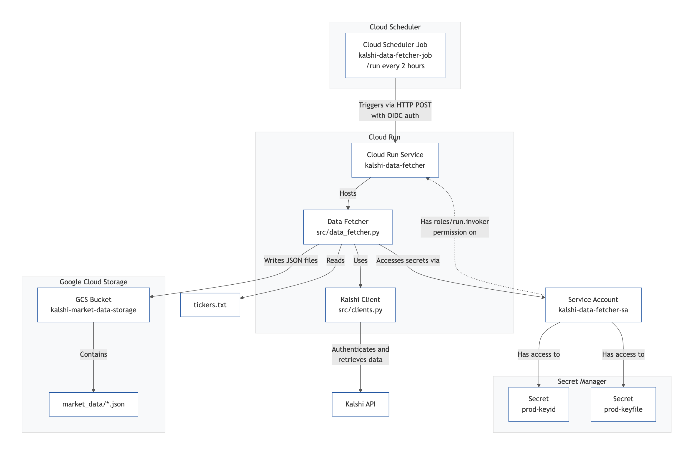

# Kalshi Automated Data Fetcher

This project implements an automated pipeline on Google Cloud Platform (GCP) to periodically fetch market data from the Kalshi API for a predefined list of tickers and store this data in Google Cloud Storage (GCS).

## Project Overview

The system is designed to run autonomously, triggered by Cloud Scheduler. It utilizes a containerized Python application hosted on Cloud Run to interact with the Kalshi API, retrieve market data for tickers specified in `tickers.txt`, and save the results as JSON files in a GCS bucket. Authentication keys are securely managed using Secret Manager.

## Architecture

The following diagram illustrates the components and flow of the deployed pipeline:



*(Diagram generated from `cloud/architecture.mmd`)*

**Explanation:**

1.  **Cloud Scheduler:** Triggers the process every 2 hours via an authenticated HTTP POST request to the Cloud Run service. Authentication uses an OIDC token derived from the service account's identity.
2.  **Cloud Run:** Hosts the containerized Python/Flask application (`src/data_fetcher.py`). It's configured for private ingress and requires authentication (requests must have the `roles/run.invoker` permission).
3.  **Service Account:** The Cloud Run service runs as `kalshi-data-fetcher-sa`, which has permissions to access secrets and write to GCS.
4.  **Secret Manager:** Securely stores the Kalshi API Key ID (`prod-keyid`) and Private Key (`prod-keyfile`) required to authenticate with the Kalshi API.
5.  **Kalshi API:** The external API from which market data is fetched using the client in `src/clients.py`.
6.  **Google Cloud Storage (GCS):** Stores the fetched market data as JSON files, organized under the `market_data/` prefix within the `kalshi-market-data-storage` bucket (or your configured bucket name). Data is appended to existing files based on ticker.
7.  **Tickers List:** The `tickers.txt` file contains the list of market tickers for which data should be fetched.

## Core Components

*   **Data Fetcher (`src/data_fetcher.py`):** Python Flask application using a custom Kalshi client (`src/clients.py`) to interact with the Kalshi API. Reads tickers from `tickers.txt` and saves data to GCS.
*   **Containerization (`Dockerfile`):** Packages the data fetcher application for deployment.
*   **Cloud Run Service (`kalshi-data-fetcher`):** Hosts the containerized data fetcher. Configured for private access and runs using the `kalshi-data-fetcher-sa` service account.
*   **Cloud Storage Bucket (`kalshi-market-data-storage`):** Stores the output JSON files under the `market_data/` prefix.
*   **Secret Manager:** Securely stores Kalshi API credentials.
*   **Cloud Scheduler Job (`kalshi-data-fetcher-job`):** Triggers the Cloud Run service's `/run` endpoint every 2 hours via HTTP POST, authenticated using OIDC.

## Deployment

The necessary GCP resources can be deployed using the commands outlined in the deployment script.

*   **Deployment Script:** `cloud/deploy-scheduler.sh` (contains gcloud commands)
*   **Manual Steps/Reference:** `cloud/deploy-scheduler.md`
*   **Template:** `cloud/deploy-scheduler-template.sh` (anonymized version)

Ensure you have configured your GCP project, enabled necessary APIs, and set up authentication (e.g., `gcloud auth application-default login`) before running the deployment script. You will also need to create the necessary secrets in Secret Manager.

## Directory Structure

```
.
├── .gitignore              # Specifies intentionally untracked files that Git should ignore
├── DESIGN.md               # Design notes
├── Dockerfile              # Container definition for the data fetcher
├── LICENSE                 # Project license
├── PROJECT_IDEAS.md        # Ideas for future development
├── README.md               # This file
├── requirements.txt        # List of Python dependencies
├── tickers.txt             # List of Kalshi tickers to fetch
├── cloud/                  # GCP deployment scripts and documentation
│   ├── architecture.mmd    # Mermaid source for the architecture diagram
│   ├── architecture.png    # Rendered architecture diagram
│   ├── deploy-scheduler.md # Manual deployment steps
│   ├── deploy-scheduler.sh # Deployment script
│   └── deploy-scheduler-template.sh # Anonymized deployment script template
├── docker-compose.yml      # Docker Compose configuration (potentially for local testing)
├── market_data/            # Local directory (Note: Production data goes to GCS)
├── pyproject.toml          # Project metadata and build configuration
├── src/                    # Source code directory
│   ├── __init__.py
│   ├── app.py              # Original Streamlit app (if still relevant)
│   ├── clients.py          # Kalshi API client
│   ├── core.py             # Core functions/classes (if used by data_fetcher)
│   ├── data_fetcher.py     # Main data fetching application (Flask)
│   └── minimal_app.py      # Minimal Flask app example
├── starter/                # Jupyter notebooks for exploration
└── tests/                  # Test suite
    └── test_outputs/       # Output data from tests
